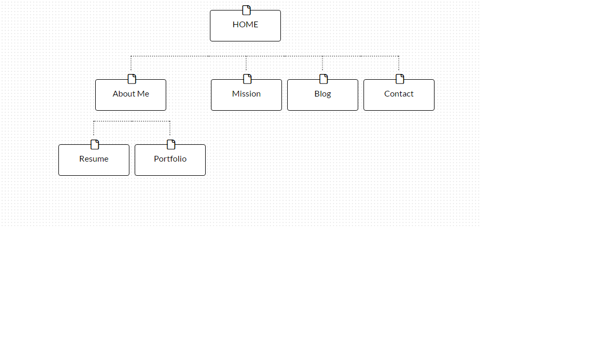

What are the 6 Phases of Web Design?
-Information Gathering
-Planning
-Design
-Development
-Testing and Delivery
-Maintenance

What is your site's primary goal or purpose? What kind of content will your site feature?
-Since this is a website about me, the primary goal of the site will be employment and allowing potential client and employers to get to know me. There will be an extensive about me section and my journey to becoming a programmer, a portfolio section to show examples of my work, and a blog so people can stay in touch with what I am to.

What is your target audience's interests and how do you see your site addressing them?
-My target audience would be people in the tech and gaming community so my site will have a lot of influences from those industries as well as how I have contributed to this culture. the blog will go into specifics of what I'm learning and how I'm applying as well as what games and software, or code languages I'm playing around with at that time.

What is the primary "action" the user should take when coming to your site? Do you want them to search for information, contact you, or see your portfolio? It's ok to have several actions at once, or different actions for different kinds of visitors.
-The most popular action I would see users taking in the beginning would be chacking my blog. In the blog will be links and references to other parts of my site, so I feel the blog is a good starting point. There will be a comment section in the blog which will be a good way to contact me, plus a link to the contact section at the end of every post.

What are the main things someone should know about design and user experience?
-It's important to consider user experience within your design because no matter how your site looks, the user experience will determine if people enjoy going to the site. I believe if you build a website or an app with UX in mind, it will show you care that people enjoy using your designs and will want to work with you more in the future. Today most sites and apps should have universal access, and if you don't for instance have a page that is mobile friendly, you aren't considering UX and doing yourself and the user a diservice.

What is user experience design and why is it valuable? 
- UXD is design focused on usability, accessibility, and pleasure the user experiences while using the product, whether is be a website or an app. It's valuable because it works on improving user satisfaction. People will enjoy the product more thus leading to them trusting the designers work in the future.

Which parts of the challenge did you find tedious?
- Using markdown to display the image was not only tedious but a little confusing because I don't remember learning any markdown syntaxbefore this challenge. Having to jump in and learn a whole new method of writing an .md file threw me off and set me back a bit. Once I did my GPS 1.1, I was pointed to the github markdown link which was a lot more clear on using syntax rather than the link attached in this challenge.