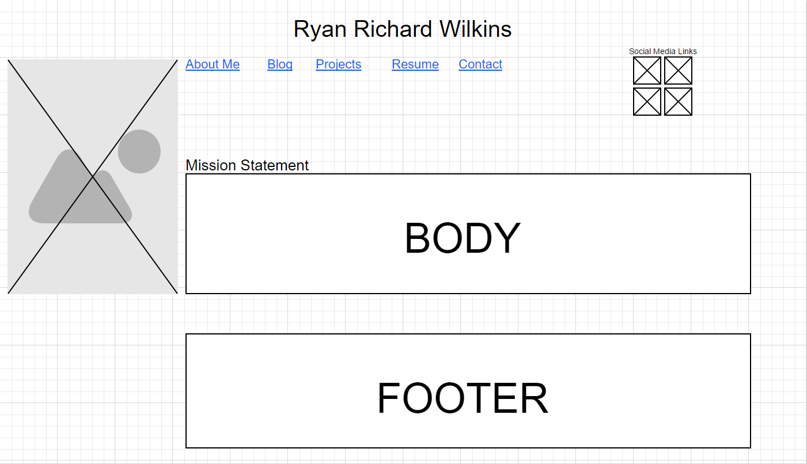
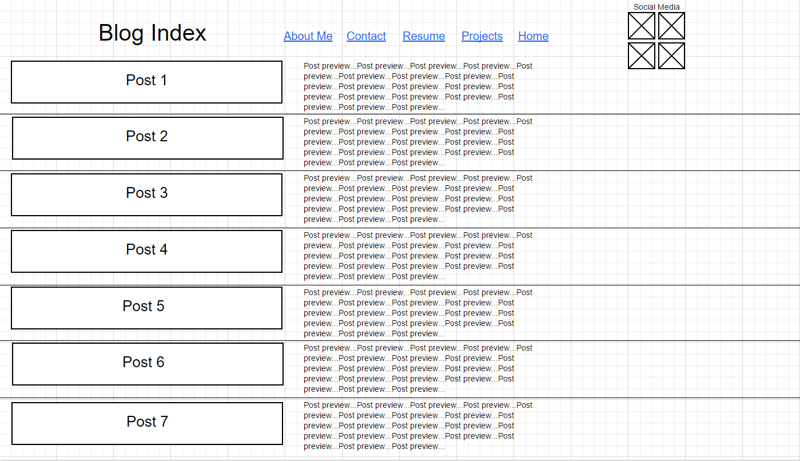

What is a wireframe?

A wireframe is a skeleton model of a webpage. It is very similar to a blue print.

What are the benefits of wireframing?

Using  wireframe helps plan the look, structure and functionality of the site so everything is planned out before completing the design. 

Did you enjoy wireframing your site?

Not entirely. I am very new to this, so it is hard to come up with a design I truly like without spending a ton of time on it. I think the perfectionist side of me made this more difficult than it needed to be and I found myself researching too many different examples of other wireframes to find what I like.

Did you revise your wireframe or stick with your first idea?

There was a lot of adjustments.

What questions did you ask during this challenge? What resources did you find to help you answer them?

I didn't ask many specific questions, but I did research many other wireframes. I googled images of wireframes for some guidance. I used moqups.com as my wireframing tool and lot of my questions came from the different options they had to drag and drop on the template. When i saw things like a video or audio link option I didn't know if it was appropriate for this challenge but I saw it in many examples of other wireframes and I like the idea of adding them to my wireframe in the future. I felt trying to fit these options would take up too much of my time for now.

Which parts of the challenge did you enjoy and which parts did you find tedious?

I enjoyed learning how to use my wireframe tool. Figuring out an appropriate layout for my wireframe of my website in general was tedious because I probably am not sure or set on exactly how I want it to look. I am a bit of a perfectionist so it is very hard for me to settle on anything. I'm sure I will play with wireframes more in the near future to really get down to how I want my site to look. I also believe once I learn more design oriented code it will help me understand my capabilites as a designer and I can start getting more creative.