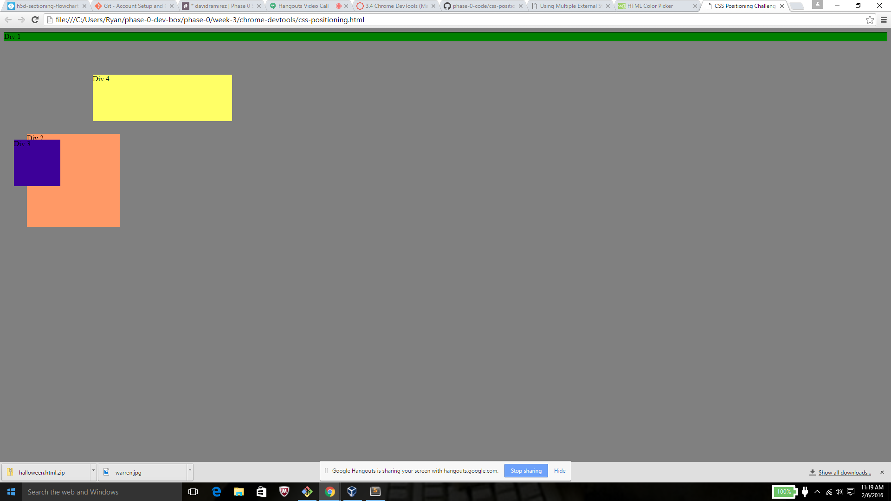
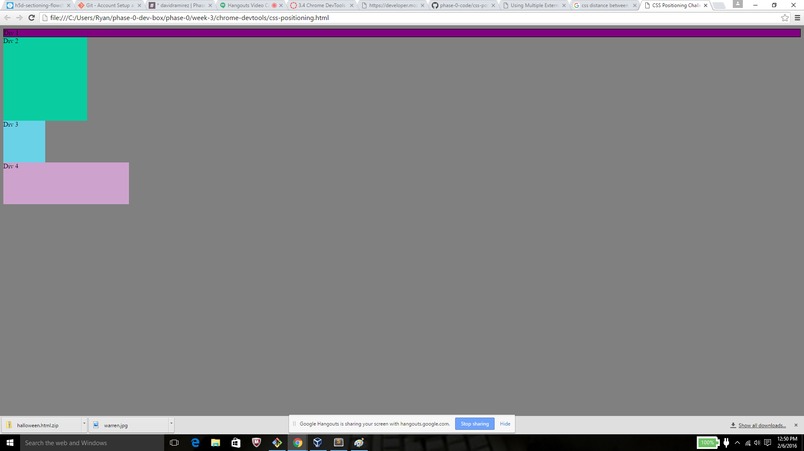
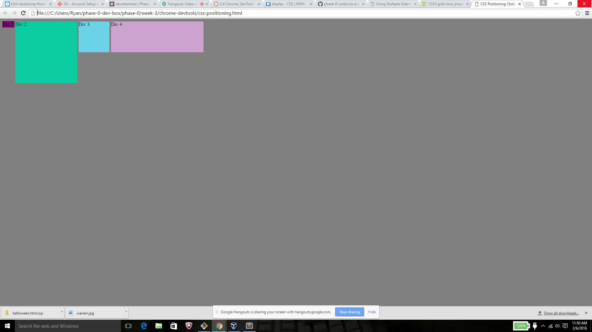
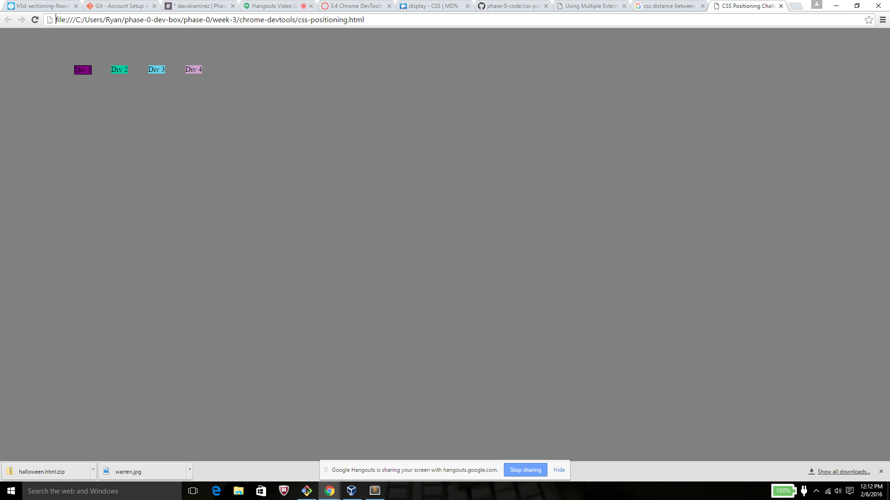
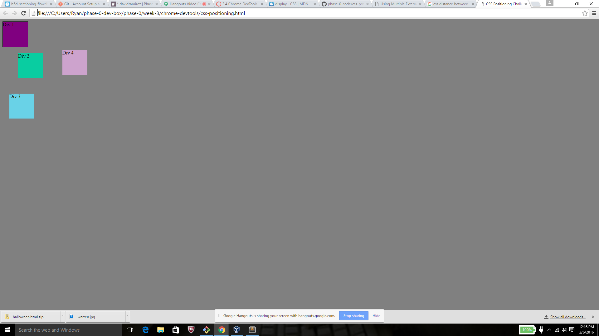
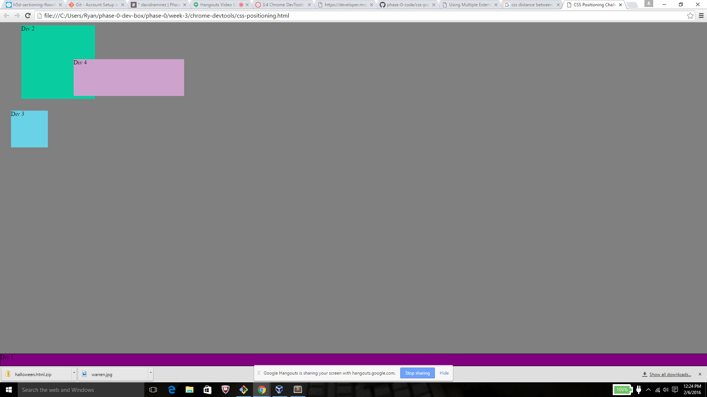
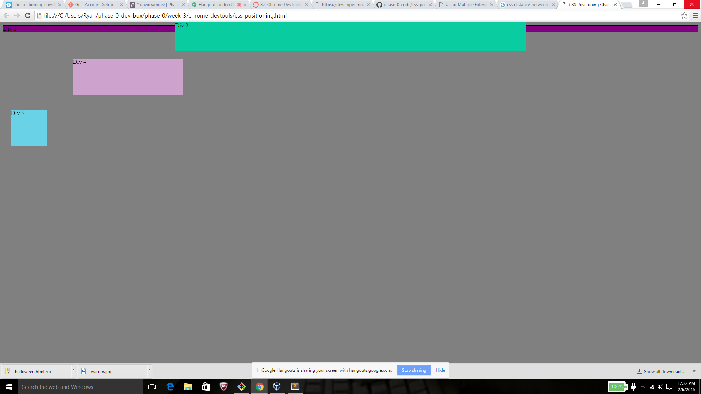
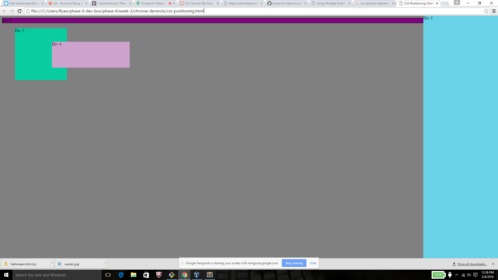
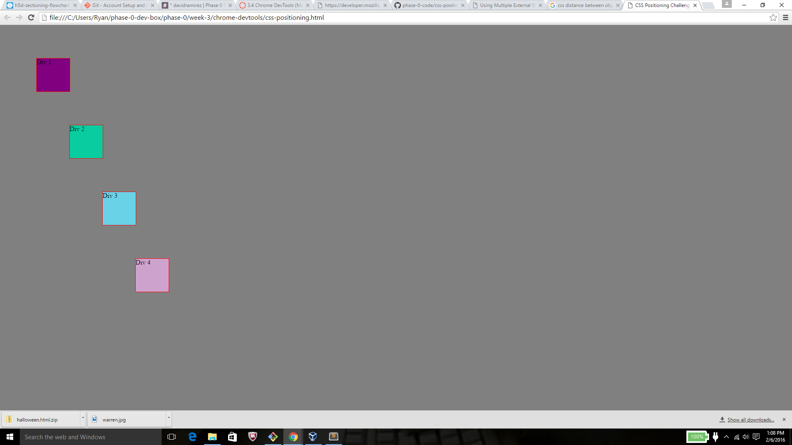

How can you use Chrome's DevTools inspector to help you format or position elements? - It is in a sense it's own form of version control. It allows you to turn code off and add new code without actually changing the file, and gives you real time results on how the change will effect the page layout.

How can you resize elements on the DOM using CSS? - Once you highlight the elemnt in HTML it opens up the CSS associated with it below. You can then change the dimensions with CSS by adjusting the heighth and width values with either "px", "em" or even a 5 value.

What are the differences between absolute, fixed, static, and relative positioning? Which did you find easiest to use? Which was most difficult? - Static is the default position. Relative is the elements relative position to itself, this one seemed to be the easiest to use. Absolute allows you to remove the elemtn and place it exactly where you want it to go. Fixed is the elements position relative to the browser and seems to the most difficult to use properly right now.

What are the differences between margin, border, and padding? - Margin is the space between different elements. Border is found literally at the edge of an object/element and has the ability to be styled differently, and padding it the white space that fills between the element and it's border.

What was your impression of this challenge overall? (love, hate, and why?) - It was a tough challenge, but I enjoyed it. I am happy to start learning about how to move around objects or elements and stay structured with style. Anytime we correctly completed an exercise, it felt really good!