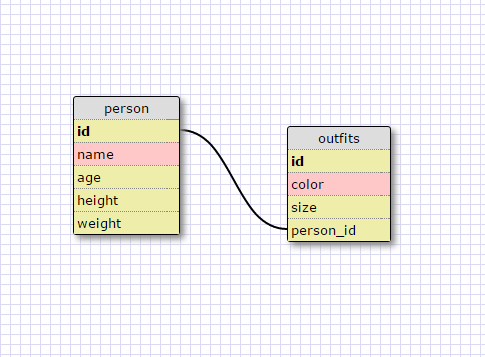

#8.4 Introduction to Database Schemas and SQL

##SQL Commands

	1.  SELECT * FROM states;

	2.  SELECT * FROM regions;

	3.  SELECT state_name,population FROM states;

	4.  SELECT state_name,population FROM states 
    	ORDER BY population DESC;

	5.  SELECT state_name FROM states WHERE region_id=7;

	6.  SELECT state_name,population_density FROM states 
    	WHERE population_density>50 
    	ORDER BY population_density ASC;

	7.  SELECT state_name FROM states
    	WHERE population BETWEEN 1000000 and 1500000;

	8.  SELECT state_name,region_id FROM states 
    	ORDER BY region_id ASC;

	9.  SELECT region_name FROM regions 
    	WHERE region_name LIKE '%central';

	10. SELECT region_name,state_name FROM regions,states
    	WHERE region_id=regions.id;

##My Schema

What are databases for?

Databases are used to store massive amounts of information, in this case as tables where you can access values or certain properties of objects.

What is a one-to-many relationship?

This is a relationship between tables where one item in the table can relate to multiple items in another table, where those items in the ladder relate to only the one item in the previous table and no other items in that same first table. So for example a manager of a restaurant manages multiple employees of a restaurant but those employees are managed by the one (and only one) manager.

What is a primary key? What is a foreign key? How can you determine which is which?

A primary key is the initial column that uniquely identifies every record of the table. The primary key's value is normally a unqiue integer and the primary key is usually named 'id'. A foreign key is used to connect one table to another. Normally the connection is made from one table's primary key to a key in another table containing the same field.

How can you select information out of a SQL database? What are some general guidelines for that?

Using the SQL command 'SELECT' we can grab information fromthe database. Commands such as 'WHERE' and 'ORDER' BY help create where we want to grab the data from and how we want to sort it. General guidelines are to keep the commans in ALL CAPS and the names of the tables, keys and values in lower case letters. Fields suchs as table name, and keys are named using 'snake_case', and just like in JavaScript, SQL likes to end it's statements with ';'. For DRYness and readability it looks like seperating each condition of your 'SELECT' command line by line looks best.