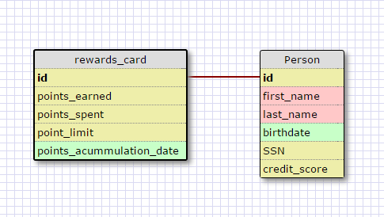
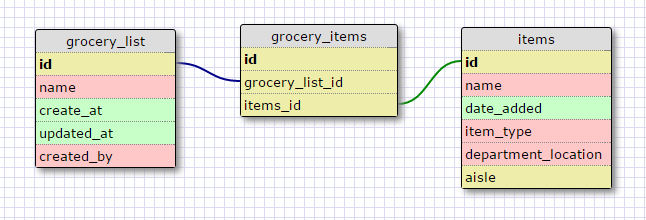

#8.5 More Schemas

##One-to-One

The logic for this relationship is that there can only be one `person` associated to one `rewards_card` for this bank, so the person and the card share the same primary key `id` number.

##Many-to-Many

##Reflection
###What is a one-to-one database?

These are used when two tables or objects have a single relationship to one-another.  

###When would you use a one-to-one database? (Think generally, not in terms of the example you created).

When one table begins to have optional supplementary info, there can be numerous bits of empty space, so you would create another table to store the optional data. This record will only be created for products in the first table that contain the optional data.

###What is a many-to-many database?

This is when two data structures can have many relationships between each other's data data. For example in our `grocery_list` example, one grocery list can have multiple items and each item can be contained in multiple grocery lists. With tables, we creat a third `join` or connector table that will relate the unique tables to one another.

###When would you use a many-to-many database? (Think generally, not in terms of the example you created).

You would use this database when you need a reference to multiple items one data structure uses, and those items can be used by multiple other data structures. In the table setting, both tables can relate to zero or multiple other tables.

###What is confusing about database schemas? What makes sense?

I'm a little confused about One-to-One relationships and what the best practice is for creating primary keys for both tables.  Under the READING: Relational Database Design it says "The same column productID should be used as the primary key for both tables." But in the challenge example shown in 8.5, the two tables have different primary keys, and the foreign key does not line up to both primaries. I'm also a little lost on what data is best to store in each table, but I'm sure that will make more sense with practice.

Everything else is straight forward, accessing data seems simple enough for now, and creating relationships is done by determining how each data structure relates to one more.